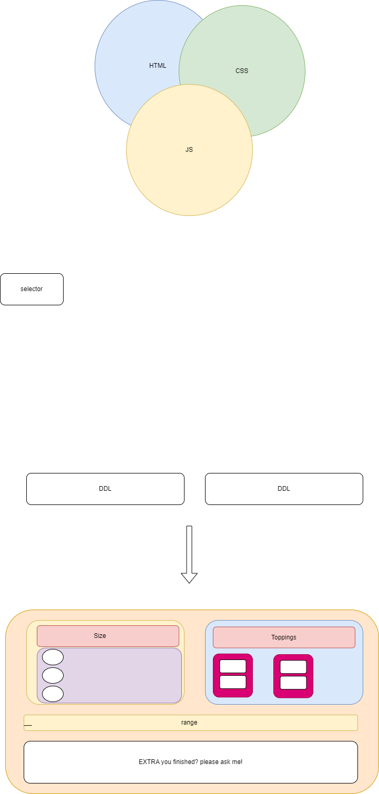

# Homework 25-12

1. Create the following Page Pizza Site based on bootstrap
2. You must use Bootstrap css from our examples in the repository `bootstrap.css` OR download it straight from the [source](https://cdn.jsdelivr.net/npm/bootstrap@5.2.3/dist/css/bootstrap.min.css)
   and using

```JS
 href="https://cdn.jsdelivr.net/npm/bootstrap@5.2.3/dist/css/bootstrap.min.css"
      rel="stylesheet"
      integrity="sha384-rbsA2VBKQhggwzxH7pPCaAqO46MgnOM80zW1RWuH61DGLwZJEdK2Kadq2F9CUG65"
      crossorigin="anonymous"
```

3. The page contains the following bootstrap UI component:

- Button
- Select
- Spinner
- More..

4. 
5. 
6. 

# Class exercise



# Homework 28-12

1. build the following layout ( chess game )
   

2. Use flex/bootstrap what ever you prefer to design the page.
3. Use images instead of the chess boards and icons ( search for images in google)

# Homework 1.1

- https://app.diagrams.net/
- Watch the Online academic course in the enablee - see screenshot below
- Solve all the exercises on page 11 ( חוברת מבוא לתכנות )
- Solve exercises 1,2,3 on page 15. ( חוברת מבוא לתכנות )
- 

# Homework 4.1

1. Write the distance exercise in Javascript ( open new file distance.js , load the file in the HTML)
2. Page 15 All exercises ( flow charts )
3. Page 15 Write ex3 & ex4 in Javascript

# Homework 8.1

1. Page 17 - ex 3 ( in JavaScript )
2. Page 17 - ex 4 ( in JavaScript + flow chart )
3. Page 17 - ex 5 ( in JavaScript + flow chart )

# 11.1

## 1

- Write a function that print your name
- Call the Function
- See the log output

## 2

- Call the function from #1 twice

# Homework

1. Page 40 Ex1.
2. Write a function that receive 3 numbers ( from prompt function ) , the function will calculate the average of those numbers and return the average.
   in the main program print the average to the console.log
3. write a function that receive country name ( from prompt function ) and return "yes - this is my country" if the selected country is "israel" otherwise return "not my country"
4. write a function that receive salary ( from prompt function ) and return the new salary after 10% raise
5. write a function that receive order of pizza ( from prompt function ) size, toppings with comma delimiter - "," and address
   for example:

```js
var size = prompt("What size you want?");
var toppings = prompt("What toppings you want?");
var address = prompt("What is your full address?");
```

the function will return the recipet with the price

- size small - 20ILS
- size med - 40ILS
- size large - 60ILS

6. write a function that receive a value ( from prompt function ) and return the type of the value

7. write a function that receive your weekly budget ( from prompt function ) and return "Stop waste your money" in case the budget is over 1000 ILS, if its less return "Good Job - keep save your money"

# 15.1

## Ex

- Loop - while

1. input - your name ( use prompt )
2. output - print your name 10 times
3. advanced: print your name X times - according to another input ( use prompt )

### Homework Page 25 ex 5 ( with the crazy teacher )

1. add option to receive the numberOfStudents ( from prompt )
2. sum all the grades
3. print the total sum

### Homework Page 25

1. exercises 4 - 12
2. watch JS academic online

# 18.1 - Homework

1. complete ex 13 in page 25
2. watch JS academic online
3. Write a Function which recieve first name & last name and `return` the full name ( use prompt )
4. write a function that recieve number of tables & number of guests and `return` the capacity of the resturant
5. write a function that calculate cart price, the function will recieve

- number of products = X
- prompt X times Product name + Product Price
- the function will `print` the final reciept

Example:

Input:

"Please Enter the number of Products" => 3
"Please Enter the name of Product 1" => "Milk"
"Please Enter the Price of Product 1" => 10
"Please Enter the name of Product 2" => "Potato"
"Please Enter the Price of Product 2" => 5
"Please Enter the name of Product 3" => "Bread"
"Please Enter the Price of Product 3" => 8

Output:

"Number of products - 3 , total amount: 23"

- Advanced: print each product in the output with his price as well

# Quiz Subject & Material

1. DOM manipulation
2. JS Objects & arrays
3. Functions
4. Document.createElement
5. Loops ( while, for )
6. CSS
7. Transitions

# 22.1

### Arrays

1. Create a function that receive from a user his favorite movies

- first input - number of movies
- second input - movies
- at the end, print the movies

2. Page 29 ex 3 

## Homework

